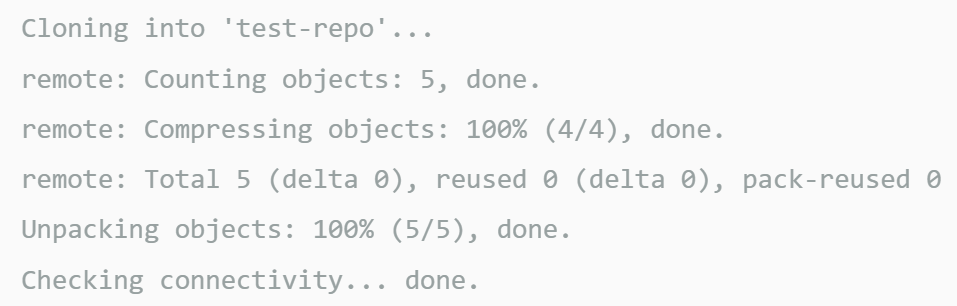

# 5-day-forcast

## Description
  - You are going to experience a 5 day weather dashboard that will run in the browser 

    

  ### User Story
    - AS A traveler
    - I WANT to see the weather outlook for multiple cities
    - SO THAT I can plan a trip accordingly

  ### Acceptance Criteria - What are the aspects of my website?
    - GIVEN a weather dashboard with form inputs
    - WHEN I search for a city
    - THEN I am presented with current and future conditions for that city and that city is added to the search history
    - WHEN I view current weather conditions for that city
    - THEN I am presented with the city name, the date, an icon representation of weather conditions, the temperature, the humidity, and the the wind speed
    - WHEN I view future weather conditions for that city
    - THEN I am presented with a 5-day forecast that displays the date, an icon representation of weather conditions, the temperature, the wind speed, and the humidity
    - WHEN I click on a city in the search history
    - THEN I am again presented with current and future conditions for that city

  ## What you are expected to see on your screen

  * A asdfasf

  * A afdsdf

## Errors to navigate
  - Google font error
    

## Installation:
  - ### Create a new repo on GitHub
      - Go to the upper right corner and click the + icon to create a New Repository
      - Enter a unique repo name (lower case & no spaces)
      - Select License (basic = MIT License)
      - Click Create Repository 

  - ### Clone the repo to a folder on your machine
      - Navigate to the directory you want to clone
      - git clone https://github.com/url-TO_REPO_HERE
          - git clone command - it copies the repo from github  to your local computer
      - git clone https://github.com/YOUR-USERNAME/YOURREPOSITORY
          - Your command line should respond as below.

          
        

  - ### Navigation
      - Navigate to the folder in which you cloned your repo
      - Click on index.html file
      - Double click to open file

## Features:
  - Weather information by current location
  - 5 day weather forecast
  - 
  

## Built with and deployed with:
  - API
  - Jquery
  - JavaScript
  - HTML
  - CSS
  - Visual Studios Code
  - Git Bash
  - GitHub
  
## Usage:
  - On your machine navigate to the folder you created.
  - Locate the Index.html file in your browser.
  - https://sheila-ha.github.io/5-day-forecast/
  - https://github.com/Sheila-Ha/5-day-forecast

## Credits:
The guide used:
 - [request-response](https://coding-boot-camp.github.io/full-stack/apis/how-to-use-api-keys)

## License:
  - By contributing, you agree that your contribution wil be licensed under its MIT License.