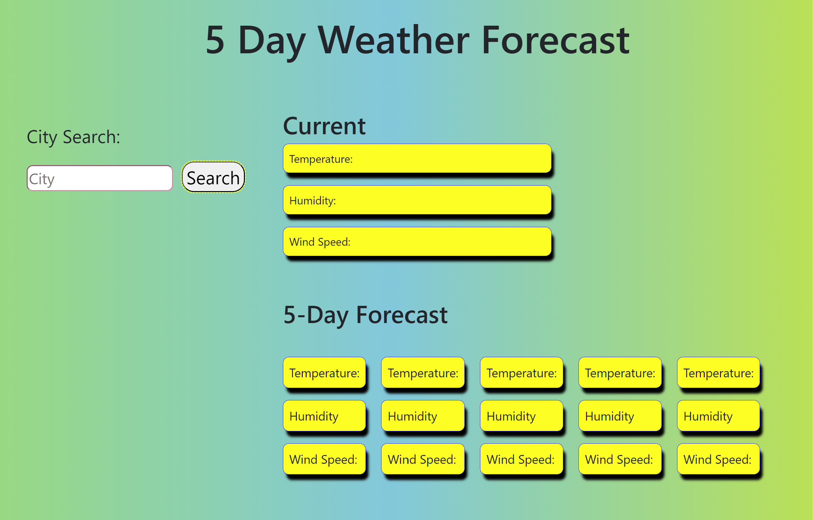
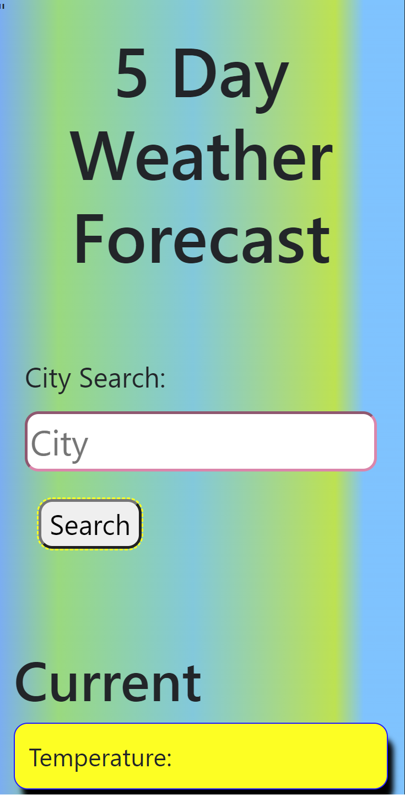
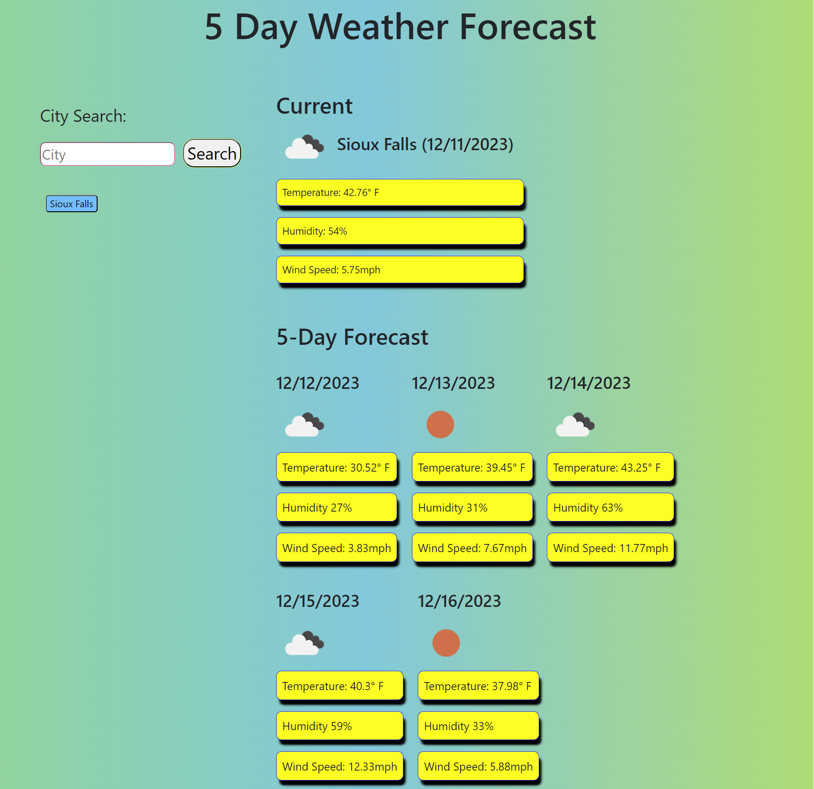
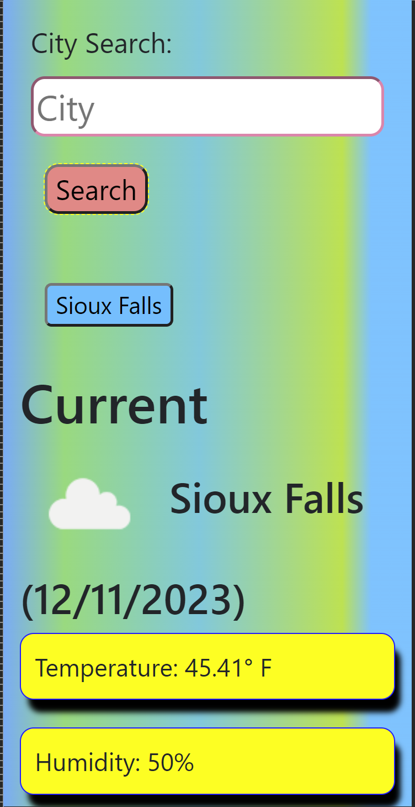
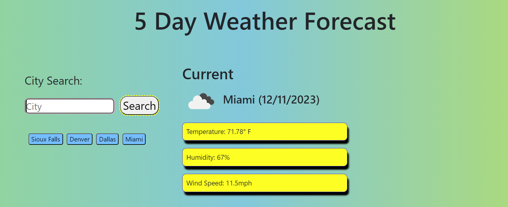
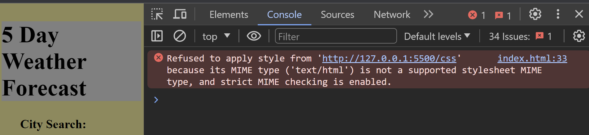
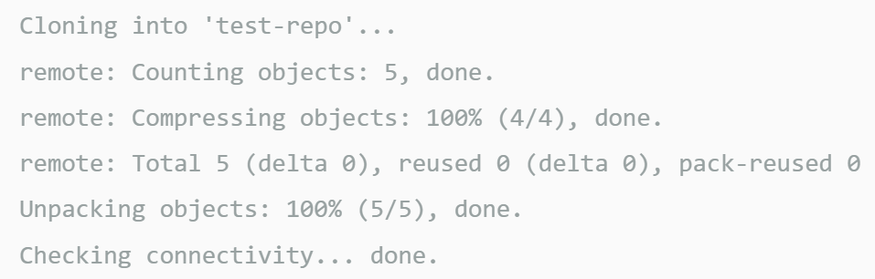

# 5-day-forcast

## Description
  - A personal experience to search a city for the weather forecast for present day and future of 5 days ahead. Your cities search wil be stored in local storage for you to click and revisit again.

    
  ### User Story
    - AS A traveler
    - I WANT to see the weather outlook for multiple cities
    - SO THAT I can plan a trip accordingly

  ### Acceptance Criteria - What are the aspects of my website?
    - GIVEN a weather dashboard with form inputs
    - WHEN I search for a city
    - THEN I am presented with current and future conditions for that city and that city is added to the search history
    - WHEN I view current weather conditions for that city
    - THEN I am presented with the city name, the date, an icon representation of weather conditions, the temperature, the humidity, and the the wind speed
    - WHEN I view future weather conditions for that city
    - THEN I am presented with a 5-day forecast that displays the date, an icon representation of weather conditions, the temperature, the wind speed, and the humidity
    - WHEN I click on a city in the search history
    - THEN I am again presented with current and future conditions for that city

  ## What you see as you navigate the app

  * [Video of how the app works](https://app.screencast.com/i3ppkrNQ7Xtvw)

  * Total view before city input
   
      *Mobile response total view
        
  * Input city select "search" and click
    
  * Total view after city input
    
      *Mobile response city search
       
  * Local storage, showing previously searched cities
    

  - An example of an error that was navigated with Google fonts 
    

## Installation:
  - ### Create a new repo on GitHub
      - Go to the upper right corner and click the + icon to create a New Repository
      - Enter a unique repo name (lower case & no spaces)
      - Select License (basic = MIT License)
      - Click Create Repository 

  - ### Clone the repo to a folder on your machine
      - Navigate to the directory you want to clone
      - git clone https://github.com/url-TO_REPO_HERE
          - git clone command - it copies the repo from github  to your local computer
      - git clone https://github.com/YOUR-USERNAME/YOURREPOSITORY
          - Your command line should respond as below.

          
        

  - ### Navigation
      - Go to the site provided below
      - [my weather app](file:///C:/Users/slhan/repos/5-day-forecast/index.html)
      - Type a City in the search field
      - Click search
      - Viewing, current weather first
      - scroll down and the 5 day weather forecast follow
      - Return to city search and enter another city and click search
      - Below city input field will be past cities you have submitted
      - You may click on a submitted city and it will show current and future weather again

## Features:
  - Weather information for city searched
  - 5 day weather forecast
  - Weather information seen temp, humidity, wind speed
  - Weather icon displayed for current and 5 day weather
  - Responsive for all different screen sizes
  

## Built with and deployed with:
  - API
  - Jquery
  - JavaScript
  - HTML
  - CSS
  - Visual Studios Code
  - Git Bash
  - GitHub
  
## Location to view:
  - https://sheila-ha.github.io/5-day-forecast/
  - https://github.com/Sheila-Ha/5-day-forecast

## Credits:
The guides used:
 - [request-response](https://coding-boot-camp.github.io/full-stack/apis/how-to-use-api-keys)
 - [W3shcools](https://www.w3schools.com/tags/default.asp)
 - [mdn web docs](https://developer.mozilla.org/en-US/docs/Web)
 - [stack overflow](https://stackoverflow.com/?newreg=67d94556b887449fa2885dadf54a5439)
 - [font-awesome](https://fontawesome.com/search?q=cloud&o=r)
 - [openweather](https://openweathermap.org/current)
 - [gradient-gen](https://omatsuri.app/gradient-generator)
 - [Capture, video made with](https://www.techsmith.com/jing-tool.html)

## License:
  - By contributing, you agree that your contribution wil be licensed under its MIT License.
  